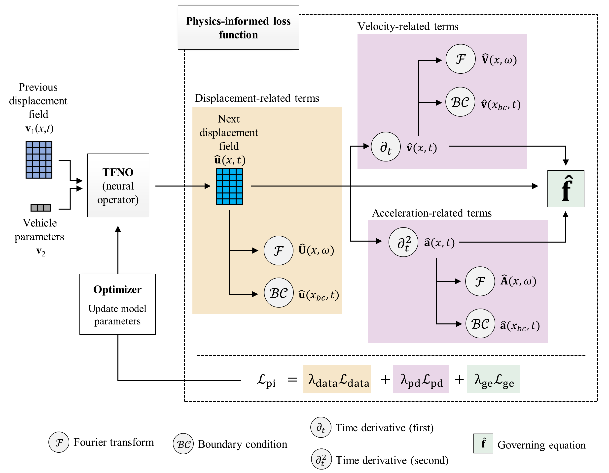

# PINO
This repository provides a demonstration implementation of the paper:

* [Physics-informed neural operator for forecasting vehicle-induced bridge vibration trajectories](https://github.com/chenrongxiu-be/PINO)

## Abstract
Simulating vehicle-bridge interaction (VBI) dynamics is critical in bridge engineering for investigating structural performance, dynamic properties, and impact factor. However, the high computational cost often limits extensive simulations and real-time applications in practice. This paper proposes a physics-informed neural operator (PINO) for forecasting vehicle-induced bridge response trajectories. The PINO integrates a custom loss function with operator learning, that embeds the physical principles of VBI dynamics. First, the performance of the proposed method is evaluated on different bridge structures under varying vehicle parameters and structural material properties, validating its accuracy and efficiency in forecasting vehicle-induced bridge vibration trajectories. Then, the PINO is evaluated in stochastic dynamic analysis for applications in structural health monitoring and reliability-based design of bridge, where its real-time inference capability significantly accelerates the overall analysis process. Additionally, an efficient surrogate modeling scheme, that combines physics-guided initialization and transfer learning, is proposed to enable rapid knowledge transfer between different bridges, even with very limited data. Comparative analysis highlights the advantages of the PINO over purely data-driven counterparts in terms of accuracy, training efficiency, and robustness in small-data regimes. To support practical implementation of the proposed approach, the guidance for configuring loss weights is provided.

<p align="center">
  
</p>

## Requirements
The implementation is based on Python with the following dependencies:
* numpy, pytorch, einops, matplotlib

## Usage
**1. Data preparation:** Download the datasets from the provided URL and place them in the ./data/ssb directory.

**2. Model training:** Run train.py

**3. Test:** Run test.py

## Dataset and pre-trained model
The dataset and pre-trained model used in this study are provided below and can be directly loaded within the accompanying scripts.
Due to the memory limits of the cloud storage service, only the data corresponding to the simply supported beam case (Dataset #1 in the paper) are made available.

[Dataset](https://stkyotouac-my.sharepoint.com/:f:/g/personal/chen_rongxiu_72m_st_kyoto-u_ac_jp/EtBH-Nyn3VxPnEiJ6GQfdgoB8WMlcfp7eUgRAjXF2wAzAA?e=Waos0u)*

[Pre-trained model](https://stkyotouac-my.sharepoint.com/:f:/g/personal/chen_rongxiu_72m_st_kyoto-u_ac_jp/Eiqa-38Eu9dGoc0wnOrEzXwBJFDnpNFrHy6n7DLjpqGgMw?e=2SMoBQ)*

**Shared via OneDrive. If you experience access issues, please try different devices or web browsers (Google Chrome is recommended).* 

## Citing
```
@unpublished{rongxiu2026pino,
  author       = {Rongxiu Chen and Chul-Woo Kim and Jiaji Wang},
  title        = {Physics-informed neural operator for forecasting vehicle-induced bridge vibrations},
  note         = {Under review in Elsevier},
  year         = {2025}
}
```
```
@article{rongxiu2025tfno,
  author = {Rongxiu Chen and Chul-Woo Kim and Jiaji Wang},
  title = {Real-time surrogate model of vehicle-bridge interaction using a multiple-input neural operator},
  journal = {Automation in Construction},
  volume = {180},
  pages = {106576},
  year = {2025},
  issn = {0926-5805},
  doi = {https://doi.org/10.1016/j.autcon.2025.106576}
}
```
